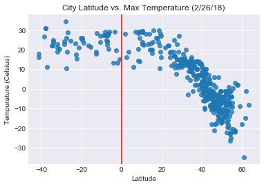
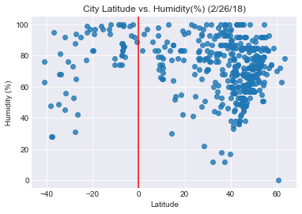
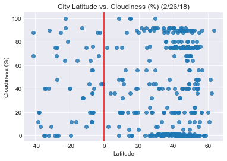
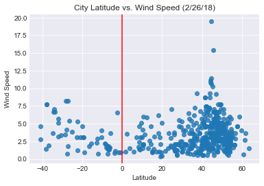

## WeatherPy

#### Analysis
##### * Max tempurature peaked at 0 degrees latitude (equator)
##### * Wind speed , humidity and cloudiness had even distribution across latitudes
##### * Currently the northern hemisphere (0-100 lat) is in winter resulting in lower max temperatures than those in the sourthern hemisphere.


```python
# Import dependencies
import numpy as np
import pandas as pd
import matplotlib.pyplot as plt
import requests as req
import json
import random
import seaborn as sns
import os
from citipy import citipy
```


```python
# get random sample from openweathermap city list
sample_size = 500
city_list = os.path.join("city.list.json")
sample_list = pd.read_json(city_list)
sample_list = pd.DataFrame(sample_list)

sample_cities = sample_list.sample(sample_size)

sample_cities.head()
```


<div>
<style scoped>
    .dataframe tbody tr th:only-of-type {
        vertical-align: middle;
    }

    .dataframe tbody tr th {
        vertical-align: top;
    }

    .dataframe thead th {
        text-align: right;
    }
</style>
<table border="1" class="dataframe">
  <thead>
    <tr style="text-align: right;">
      <th></th>
      <th>coord</th>
      <th>country</th>
      <th>id</th>
      <th>name</th>
    </tr>
  </thead>
  <tbody>
    <tr>
      <th>109248</th>
      <td>{'lon': -82.565376, 'lat': 27.40143}</td>
      <td>US</td>
      <td>4146587</td>
      <td>Ballentine Manor</td>
    </tr>
    <tr>
      <th>168751</th>
      <td>{'lon': 107.962196, 'lat': -7.1499}</td>
      <td>ID</td>
      <td>7920665</td>
      <td>Balakasap</td>
    </tr>
    <tr>
      <th>103132</th>
      <td>{'lon': 69.055, 'lat': 41.113331}</td>
      <td>UZ</td>
      <td>1538262</td>
      <td>Yangiyŭl Shahri</td>
    </tr>
    <tr>
      <th>151713</th>
      <td>{'lon': 4.5467, 'lat': 44.716499}</td>
      <td>FR</td>
      <td>6615784</td>
      <td>Saint-Priest</td>
    </tr>
    <tr>
      <th>165188</th>
      <td>{'lon': 107.898598, 'lat': -7.1099}</td>
      <td>ID</td>
      <td>1638107</td>
      <td>Leles</td>
    </tr>
  </tbody>
</table>
</div>


```python
api_key = "09b5e513d610e151dcad61efd3016f9f"
url = "http://api.openweathermap.org/data/2.5/weather?"
units = "metric"


weather_data = []
cityIDs = sample_cities["id"].tolist()
query_url = url + "appid=" + api_key + "&units=" + units + "&id="


for ID in cityIDs:
    weather_data.append(req.get(query_url + str(ID)).json())

weather_data[0]

# http://api.openweathermap.org/data/2.5/group?id=524901,703448,2643743&units=metric
```


    {'base': 'stations',
     'clouds': {'all': 1},
     'cod': 200,
     'coord': {'lat': 27.4, 'lon': -82.57},
     'dt': 1519695300,
     'id': 4146587,
     'main': {'humidity': 94,
      'pressure': 1022,
      'temp': 23,
      'temp_max': 23,
      'temp_min': 23},
     'name': 'Ballentine Manor',
     'sys': {'country': 'US',
      'id': 731,
      'message': 0.0045,
      'sunrise': 1519732581,
      'sunset': 1519774193,
      'type': 1},
     'visibility': 16093,
     'weather': [{'description': 'clear sky',
       'icon': '01n',
       'id': 800,
       'main': 'Clear'}],
     'wind': {'deg': 310, 'speed': 2.1}}


```python
#Get temperature and latitude date
temp_data = [data.get("main").get("temp_max") for data in weather_data]
lat_data = [data.get("coord").get("lat") for data in weather_data]
humid_data = [data.get("main").get("humidity") for data in weather_data]
cloudy_data = [data.get("clouds").get("all") for data in weather_data]
wind_data = [data.get("wind").get("speed") for data in weather_data]

plot_data = {"Temperature": temp_data, "Latitude": lat_data, "Humidity": humid_data, "Cloudiness": cloudy_data, "Wind Speed": wind_data}
plot_data_df = pd.DataFrame(plot_data)
plot_data_df.head()
```


<div>
<style scoped>
    .dataframe tbody tr th:only-of-type {
        vertical-align: middle;
    }

    .dataframe tbody tr th {
        vertical-align: top;
    }

    .dataframe thead th {
        text-align: right;
    }
</style>
<table border="1" class="dataframe">
  <thead>
    <tr style="text-align: right;">
      <th></th>
      <th>Cloudiness</th>
      <th>Humidity</th>
      <th>Latitude</th>
      <th>Temperature</th>
      <th>Wind Speed</th>
    </tr>
  </thead>
  <tbody>
    <tr>
      <th>0</th>
      <td>1</td>
      <td>94</td>
      <td>27.40</td>
      <td>23.00</td>
      <td>2.10</td>
    </tr>
    <tr>
      <th>1</th>
      <td>36</td>
      <td>83</td>
      <td>-7.15</td>
      <td>24.28</td>
      <td>1.41</td>
    </tr>
    <tr>
      <th>2</th>
      <td>0</td>
      <td>87</td>
      <td>41.11</td>
      <td>9.00</td>
      <td>3.10</td>
    </tr>
    <tr>
      <th>3</th>
      <td>0</td>
      <td>52</td>
      <td>44.72</td>
      <td>-10.70</td>
      <td>4.56</td>
    </tr>
    <tr>
      <th>4</th>
      <td>36</td>
      <td>83</td>
      <td>-7.11</td>
      <td>24.28</td>
      <td>1.41</td>
    </tr>
  </tbody>
</table>
</div>


### Tempurature (C) vs. Latitude


```python
# Build scatter plot
sns.regplot(x=plot_data_df["Latitude"], y=plot_data_df["Temperature"], fit_reg=False, marker="o")

# Incorporate the other graph properties
sns.set_style("dark")
plt.title("City Latitude vs. Max Temperature (2/26/18)")
plt.ylabel("Tempurature (Celsius)")
plt.xlabel("Latitude")
plt.grid(True)
plt.axvline(0, color='r')


# Save the figure
plt.savefig("Lat_v_Temp.png")

# Show plot
plt.show()
```





### Humidity (%) vs. Latitude


```python
sns.regplot(x=plot_data_df["Latitude"], y=plot_data_df["Humidity"], fit_reg=False, marker="o")

# Incorporate the other graph properties
sns.set_style("dark")
plt.title("City Latitude vs. Humidity(%) (2/26/18)")
plt.ylabel("Humidity (%)")
plt.xlabel("Latitude")
plt.grid(True)
plt.axvline(0, color='r')

# Save the figure
plt.savefig("Lat_v_Humidity.png")

# Show plot
plt.show()
```





### Latitude vs. Cloudiness Plot


```python
sns.regplot(x=plot_data_df["Latitude"], y=plot_data_df["Cloudiness"], fit_reg=False, marker="o")

# Incorporate the other graph properties
sns.set_style("dark")
plt.title("City Latitude vs. Cloudiness (%) (2/26/18)")
plt.ylabel("Cloudiness (%)")
plt.xlabel("Latitude")
plt.grid(True)
plt.axvline(0, color='r')

# Save the figure
plt.savefig("Lat_v_Cloud.png")

# Show plot
plt.show()
```





### Latitude vs. Wind Speed


```python
sns.regplot(x=plot_data_df["Latitude"], y=plot_data_df["Wind Speed"], fit_reg=False, marker="o")

# Incorporate the other graph properties
sns.set_style("dark")
plt.title("City Latitude vs. Wind Speed (2/26/18)")
plt.ylabel("Wind Speed")
plt.xlabel("Latitude")
plt.grid(True)
plt.axvline(0, color='r')

# Save the figure
plt.savefig("Lat_v_Temp.png")

# Show plot
plt.show()
```




